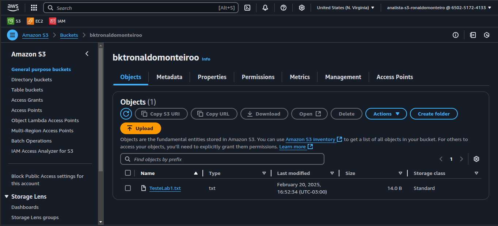
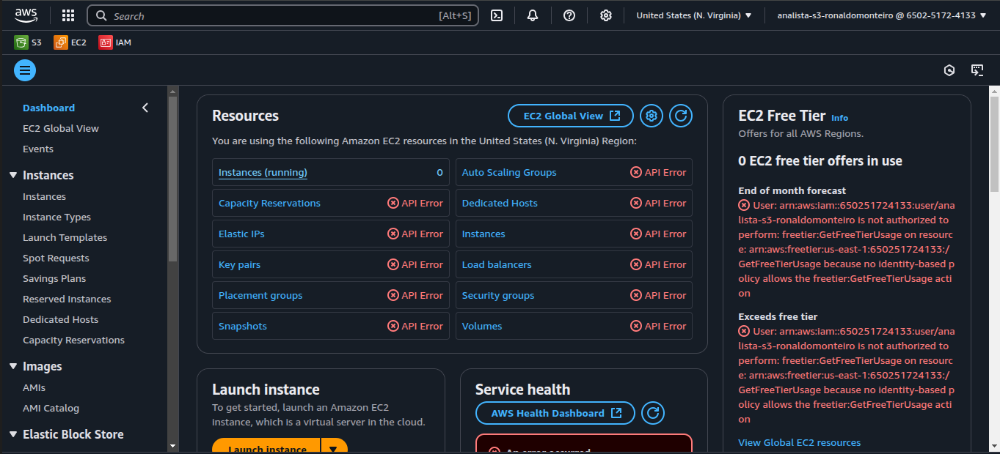
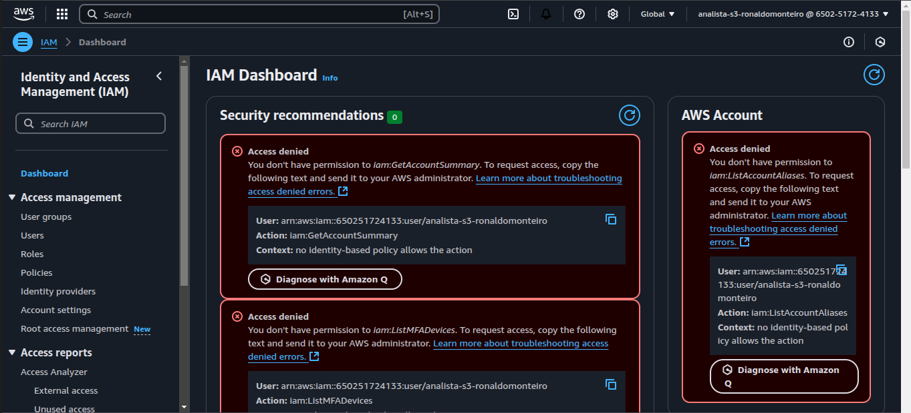

## AWS IAM: Criando e Acessando um bucket S3 com permissão de Somente Leitura

 **Objetivo**

Criar um usuário IAM que pode apenas visualizar os conteúdos dos buckets S3, utilizando o console da AWS. Configurar todo o serviço utilizando o Terraform como IAC.

 **Cenário**

Um analista de dados precisa visualizar os arquivos armazenados nos buckets S3, mas não deve modificar nada, nem ter acesso a outros recursos da AWS.

 **Configuração**

### Criar um usuário IAM no AWS.

Atribuir uma política personalizada com permissões somente leitura para o S3.
Garantir que o usuário tenha acesso ao console da AWS.
O usuário não poderá excluir, modificar ou enviar arquivos para os buckets.
A política pode ser ajustada para limitar o acesso a buckets específicos.

### Segue toda a infraestrutura via Terraform:

```hcl
provider "aws" {
  region = "us-east-1" 
}

resource "aws_s3_bucket" "example" {
  bucket = "bktronaldomonteiro" 

  tags = {
    Name        = "bktronaldomonteiro"
    Environment = "Devops"
  }
}

resource "aws_s3_object" "example_file" {
  bucket = aws_s3_bucket.example.id
  key    = "TesteLab1.txt"  # Nome do arquivo no S3
  source = "/home/ronaldo/Turma DPCN 10/LAB01/TesteLab1.txt" # Caminho do arquivo local  
}

resource "aws_s3_bucket_versioning" "example_versioning" {
  bucket = aws_s3_bucket.example.id
  versioning_configuration {
    status = "Enabled"
  }
}

output "bucket_name" {
  value = aws_s3_bucket.example.id
}

resource "aws_iam_user" "analista_s3" {
  name = "analista-s3-ronaldomonteiro"
}

resource "aws_iam_user_login_profile" "analista_s3_profile" {
  user                    = aws_iam_user.analista_s3.name
  password_reset_required = false
}

resource "aws_iam_policy_attachment" "analista_s3_policy" {
  name       = "analista-s3-policy-attachment"
  users      = [aws_iam_user.analista_s3.name]
  policy_arn = "arn:aws:iam::aws:policy/AmazonS3ReadOnlyAccess"
} 
```

### Seguem os prints

#### Acessando o Bucket S3 > acesso Permitido!

<p align="center">
  
</p>

#### Tentando acessar o EC2 > acesso negado!
<p align="center">
  
</p>


#### Tentando acessar o IAM> acesso negado!
<p align="center">
  
</p>


## Resumo

O objetivo deste serviço é criar e configurar um usuário **IAM** (Identity and Access Management) no **AWS** com permissões de **somente leitura** para acessar e visualizar os conteúdos de um bucket **S3**, utilizando o console da AWS. O usuário não terá permissão para modificar, excluir ou enviar arquivos para o bucket.

A infraestrutura é configurada utilizando **Terraform**, o que permite a criação e a gestão do ambiente como código (**IaC**). Além disso, uma política personalizada com permissões restritas ao S3 é atribuída ao usuário IAM. A política é baseada na **AmazonS3ReadOnlyAccess**, garantindo que o analista de dados possa apenas visualizar os arquivos armazenados no S3.

### O Terraform também é usado para criar:

- O bucket **S3** onde os arquivos serão armazenados.
- O arquivo de exemplo dentro do bucket.

- O usuário **IAM** com acesso somente leitura e sua configuração de login no console da AWS.

Essa abordagem permite que um analista de dados visualize e acompanhe os arquivos no S3 sem ter a capacidade de realizar alterações, garantindo segurança e controle de acesso adequado à infraestrutura da AWS.
